# 프로젝트 환경설정하기

### Spring Initializr를 통한 초반 세팅
다음과 같이 spring initalizr 를 설정하여 파일을 다운받고 intellij에서 gradle을 build했다.
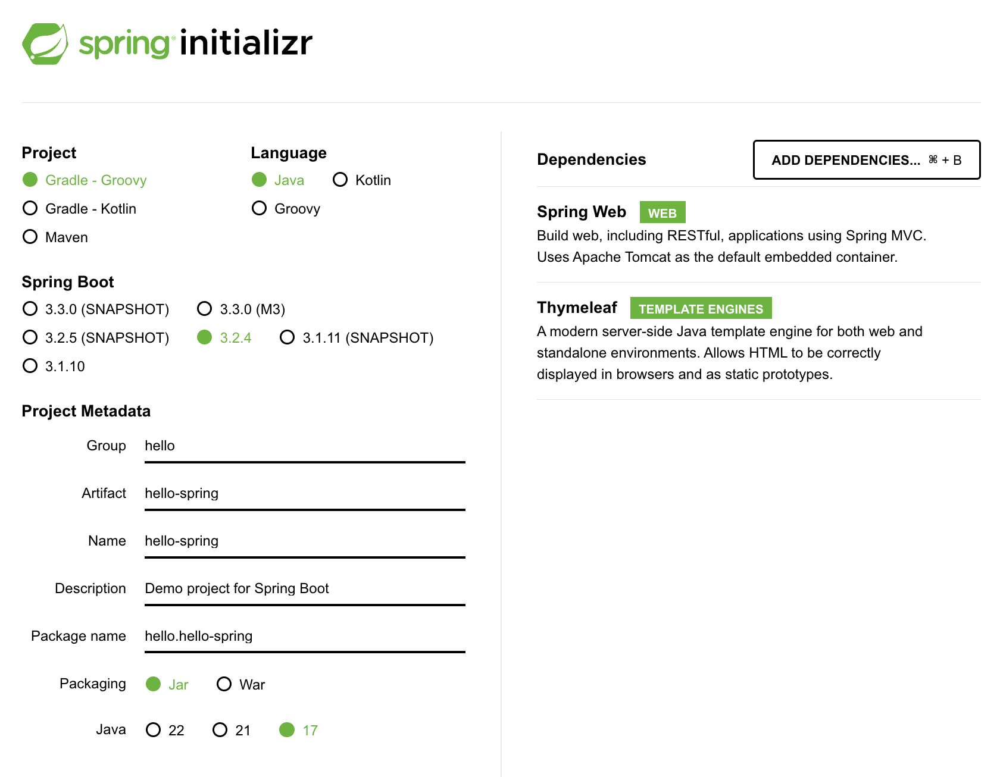

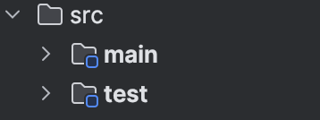
src폴더를 보면 main과 test로 나눠져 있는 것을 볼 수 있다.

실행시켜보자

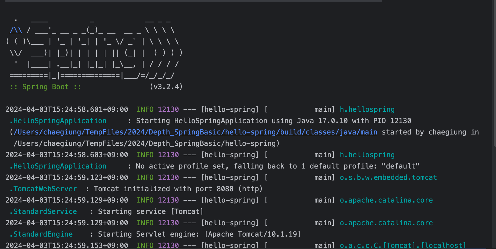
*실행시켰을 때의 모습*

자바 프로젝트의 빠른 실행과 테스트를 위해 gradle 설정에서 Build and run using과 Run tests using 부분을 InteliiJ IDEA로 바꿔주자
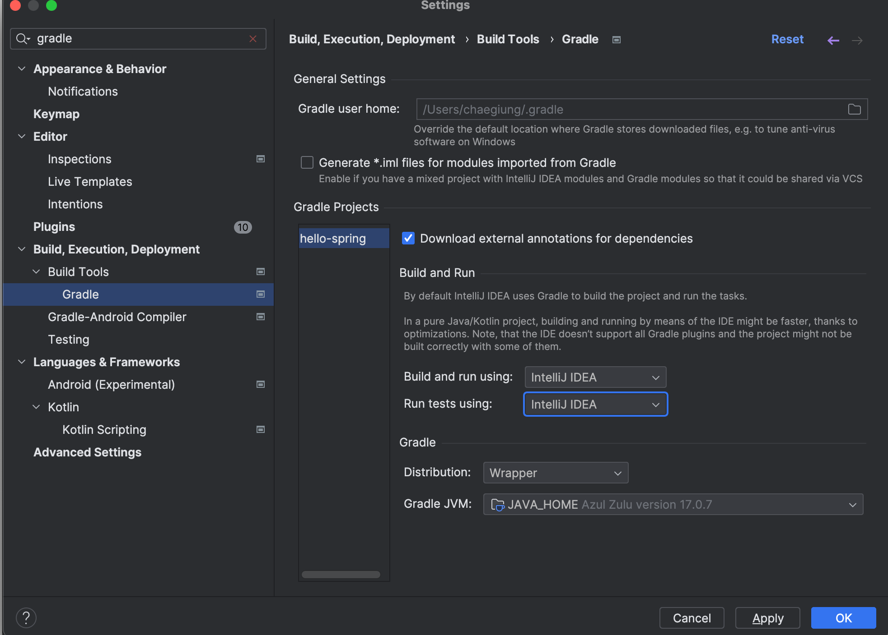
# 라이브러리 살펴보기
gradle (또는 maven)은 라이브러리간의 의존관계를 관리하는 역할을 한다.

로그 관련 라이브러리
- SLF4J(Simple Logging Facade for Java)
- logback
	- SLF4J하는 경우가 많음
	- 로그 레벨에 따른 동적 로깅 구성 가능


#### spring boot에 있는 주요 라이브러리
- spring-boot-starter-web
    - spring-boot-starter-tomcat: 톰캣 웹서버가 기본 내장되어있음
    - spring-webmvc: 웹 애플리케이션을 개발할 때 모델-뷰-컨트롤러 아키텍처를 지원하는 프레임워크
- spring-boot-starter-thymleaf: 타임리프 템플릿 엔진(view를 담당)

#### 테스트 라이브러리
- spring-boot-starter-test
    - junit
    - mockito: 모킹 라이브러릴
    - assertj: 테스트 코드 작성을 편리하게 도와주는 라이브러리
    - spring-test(스프링 통합 테스트 지원)


다음과 같이 

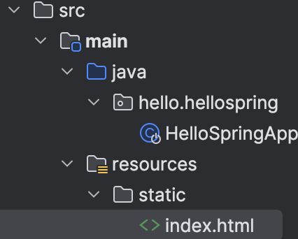
여기에 index.html을 넣어주면 localhost:8080 진입시 로드되는 페이지가 index.html이 된다.


Index.html

>viewResolver가 화면을 찾아서 처리한다!

### spring-boot-devtools
꿀팁) `spring-boot-devtools`를 이용하면 서버재시작 없이 html이 업데이트되어 view 파일의 변경사항을 확인할 수 있다!
- spring-boot-devtools
	- devtools: spring boot에서 제고앟는 개발 편의를 위한 모듈
	- 아래의 5가지 기능 제공
		- property defaults
		- automatic restart
		- live reload
		- global settings
		- remote applications
	- ⇨ 브라우저로 전송되는 내용들에 대한 코드가 변경되면, 자동으로 어플리케이션을 재시작하여 업데이트를 해주는 것이다!
	  [출처](https://barbera.tistory.com/47)
	- 설치방법: 
```java
	dependencies {   
compileOnly("org.springframework.boot:spring-boot-devtools") }
```
위 코드를 추가하면 된다
#### Automatic Restart 적용방법
그리고 Setting > Build, Execution, Deployment > Compiler에 들어가서 다음과 같이 `Build project automatically` 부분을 체크한 다음 `Apply` 버튼을 눌러주면 된다. 
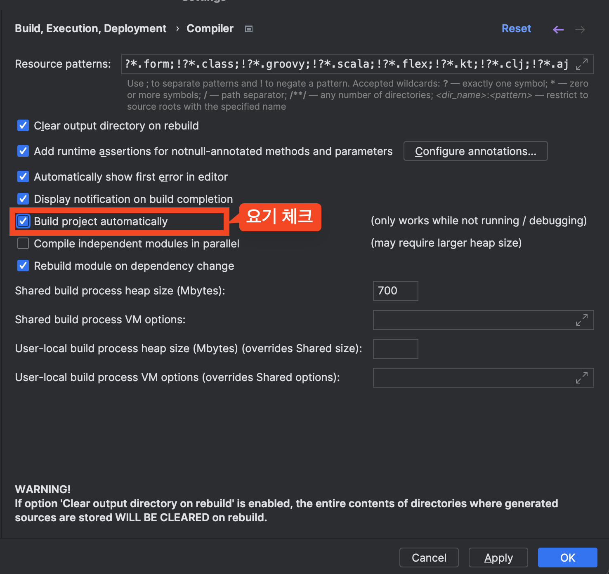

#### Live Reload 적용하기
`application.properties`에 다음 코드 추가해서 넣기
```properties
spring.devtools.livereload.enabled=true
spring.resources.static-locations=file:src/main/resources/static/
spring.thymeleaf.cache=false
spring.thymeleaf.prefix=file:src/main/resources/templates/
```
적용 후 재실행하면
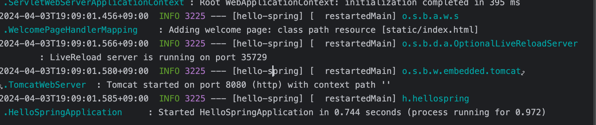
다음과 같이 `: LiveReload server is running on port 35729`라는 로그를 확인할 수 있다.


또는 인텔리제이에서 정적 파일 접근시 아래와 같은 팝업이 뜨는데, 
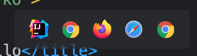 
여기서 한 브라우저를 클릭해주면 live reload 환경에서 탬플릿을 작성할 수 있다.
# 빌드하고 실행하기

## 빌드
```sh
./gradlew build
```

빌드 결과
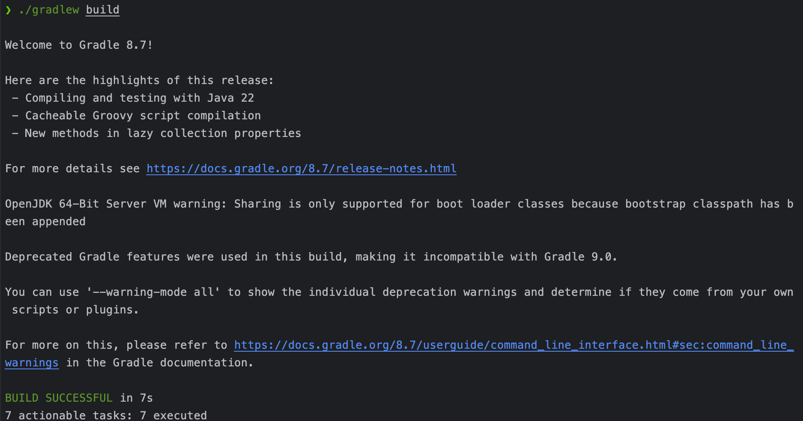
빌드파일은 `.jar` 확장자이다.

## 빌드파일 찾기, 실행

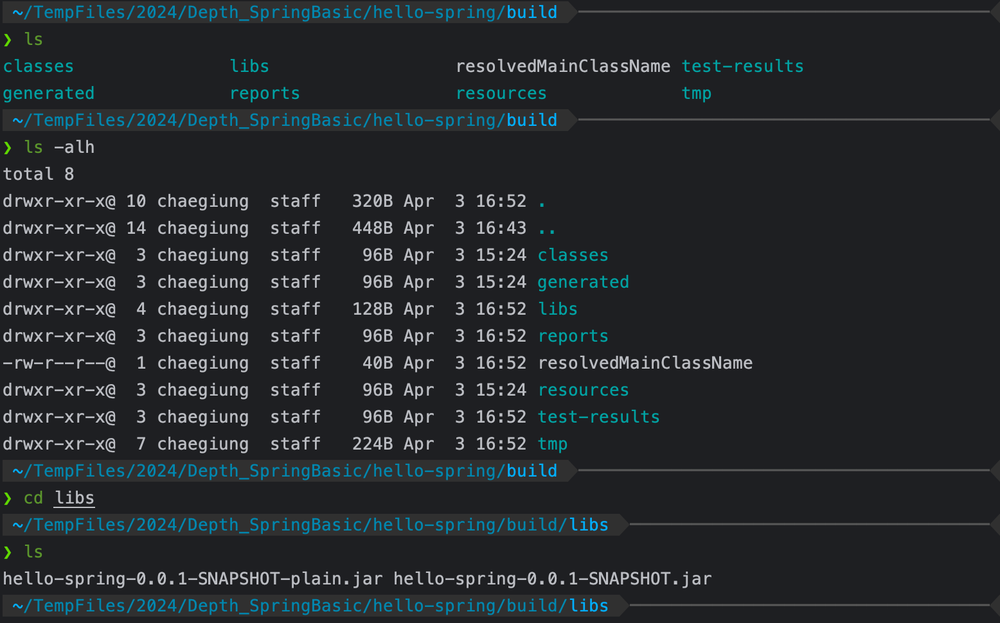
- 풀 권한, 파일 확인하기: ` ls -arlth`
빌드된 `jar` 파일은 `java <빌드파일명>.jar`로 실행시키면 된다.

---
# Spring 웹개발 기초
- spring boot는 기본적으로 정적컨텐츠(static)을 찾아서 제공하는 역할을 갖고있다.
- controller는 사용자의 요청을 제일 먼저 받아 처리하는 계층이다.
### MVC와 탬플릿 엔진

MVC패턴할 때 그 MVC 맞다.

MVC 패턴: Model-View-Controller의 약자로, 소프트웨어를 세 가지 주요 부분으로 분할하여 각 부분이 서로의 동작에 영향을 미치지 않고 독립적으로 작동할 수 있도록 함.
- MVC:
	- **Model**: 애플리케이션의 비즈니스 로직과 데이터를 포함한다. 주로 Java 객체로 표현되며, 데이터의 상태를 저장하고 처리한다.
	- **View**: 사용자에게 보여지는 UI(사용자 인터페이스)를 생성한다. 주로 HTML, JSP, Thymeleaf 등의 템플릿을 사용하여 모델로부터 데이터를 받아 사용자에게 표시한다.
		- 요 강의에서는 View의 템플릿 엔진으로 thymleaf를 사용한다.
	- **Controller**: 요청을 처리하고 적절한 응답을 생성한다. 클라이언트로부터의 요청을 받아 해당 요청을 처리하고, 모델을 업데이트하고, 적절한 뷰를 선택하여 응답을 생성한다. 일반적으로 URL 매핑을 통해 요청을 처리한다.

cf) 역할과 책임관련 얘기
##### SOLID 원칙
- **S - Single Responsibility Principle (단일 책임 원칙)**
  - 클래스는 한 가지 책임만 가져야 함.
  - 하나의 클래스가 여러 가지 이유로 변경되면 유지보수가 어려워짐.

- **O - Open/Closed Principle (개방-폐쇄 원칙)**
  - 확장에는 열려 있어야 하고, 변경에는 닫혀 있어야 함.
  - 새로운 기능을 추가할 때 기존의 코드를 수정하지 않아야 함.

- **L - Liskov Substitution Principle (리스코프 치환 원칙)**
  - 상위 타입의 객체를 하위 타입의 객체로 교체할 수 있어야 함.
  - 이는 하위 클래스가 상위 클래스의 기능을 변경하지 않고 재정의하지 않아야 함.

- **I - Interface Segregation Principle (인터페이스 분리 원칙)**
  - 클라이언트는 사용하지 않는 인터페이스에 의존하지 않아야 함.
  - 여러 개의 구체적인 인터페이스보다는 한 개의 일반적인 인터페이스가 좋음.

- **D - Dependency Inversion Principle (의존성 역전 원칙)**
  - 추상화에 의존해야 하고, 구체적인 구현체에 의존하면 안 됨.
  - 상위 수준 모듈은 하위 수준 모듈에 의존해서는 안 되며, 둘 다 추상화에 의존해야 함.
---


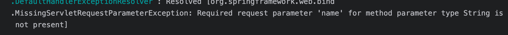
thymeleaf 장점: 브라우저로 탬플릿파일 자체를 열어봐도  html 구조가 구현됨 (실제 백엔드 작동시에는 html로 변환하는 과정을 거쳐야 함)

### API
API: Application Programming Interface의 약자로, 소프트웨어 컴포넌트나 서비스가 상호작용할 수 있는 방법을 정의함.
spring에서 이야기 하는 API: 클라이언트가 백엔드와 통신할 수 있는 인터페이스 규격

**Controller에서 `@ResponseBody` 어노테이션 사용시**:
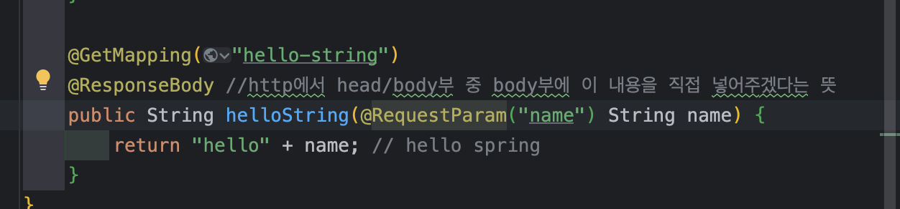
- hellospring이 html형태가 아닌 문자열 그 자체 형태로 전달되는 것을 확인할 수 있다.
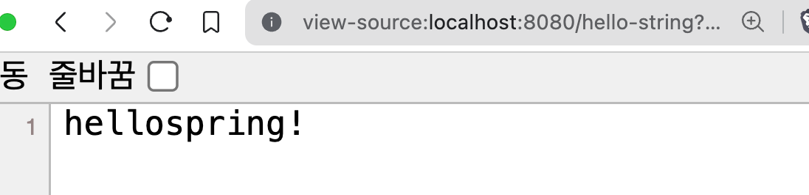


**Controller가 객체를 반환할 경우:**
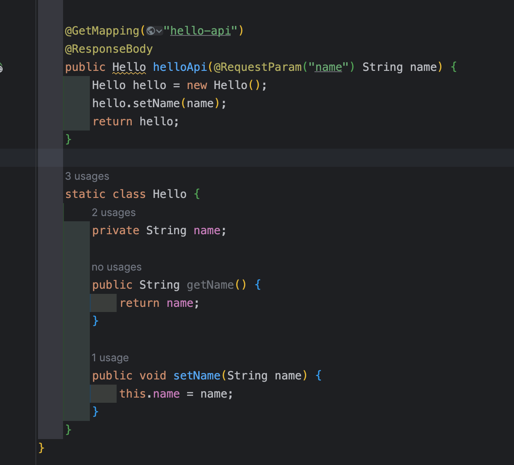
json이 리턴됨!
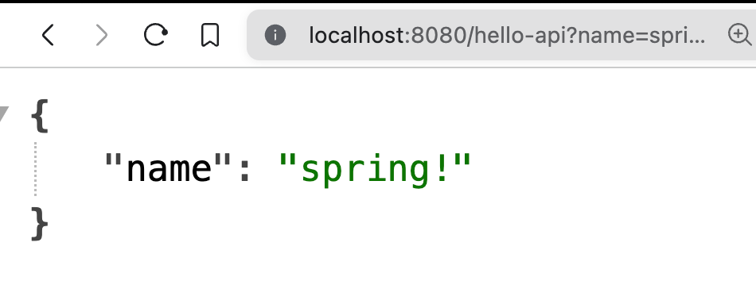

**Getter and Setter**
- Java Bean 표준방식이라고 함
- 또는 property 접근방식이라고 함
인텔리제이 단축키: command+N ⇨ Getter and Setter 선택

cf) Java Bean: 자바(스프링 컨테이너)에서 재사용 가능한 컴포넌트를 나타내는 것으로, 특정 규칙을 따르는 클래스를 말함.
-  특정규칙
	- property(private 내부 필드가 있으며, getter setter로 접근 가능한 특징)를 가져야 함
	- Serializable 인터페이스를 구현해야 함
	- bean 스펙을 따름 (POJO) 등

`@ResponseBody`가 붙어있는 메서드가 있으면 HttpMessageConverter에 넘겨짐.
그런데 리턴하는 값이 객체라면?

몇 가지 조건을 보고 JsonConverter 또는 StringConverter 등을 통해 JSON 또는 문자열 등의 적절한 형태로 변환하여 서버에서 응답함.
HTTP 헤더의 Accept 조건에 따라 적절한 형태의 자료로 변환하여 리턴함.